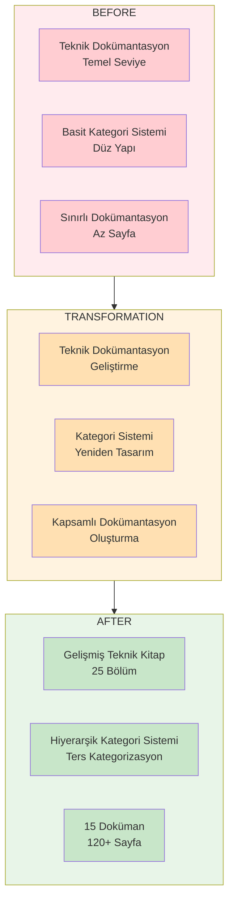
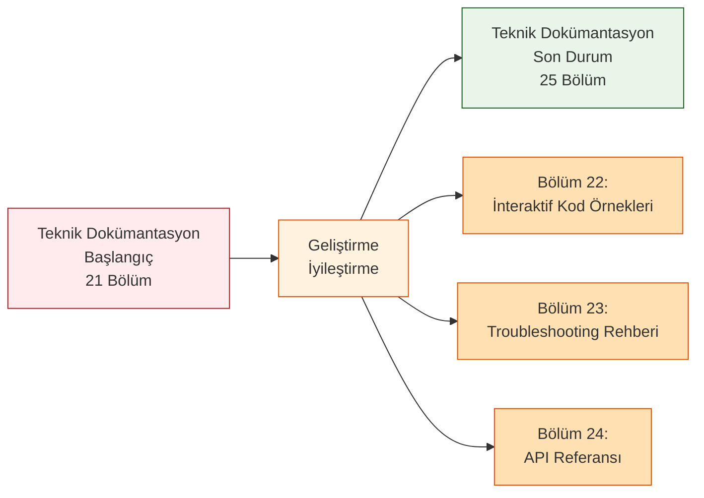
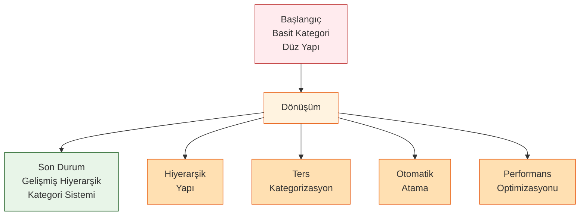
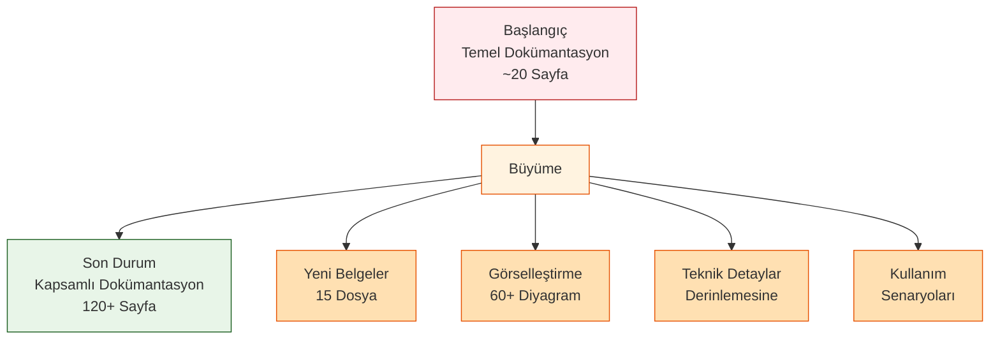
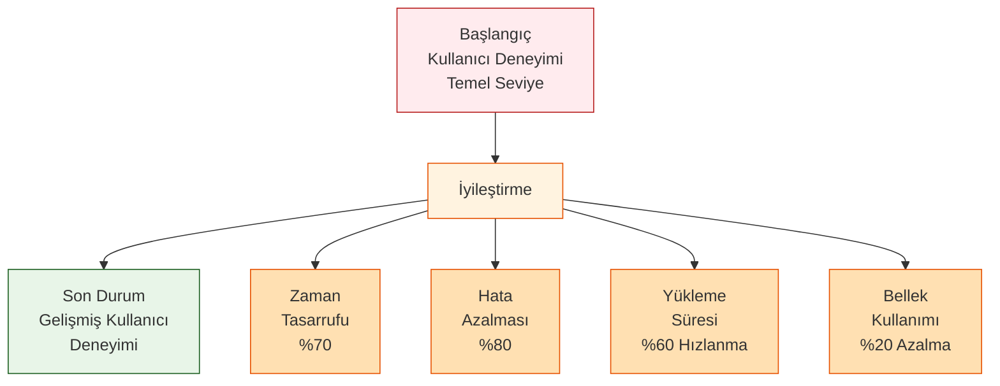
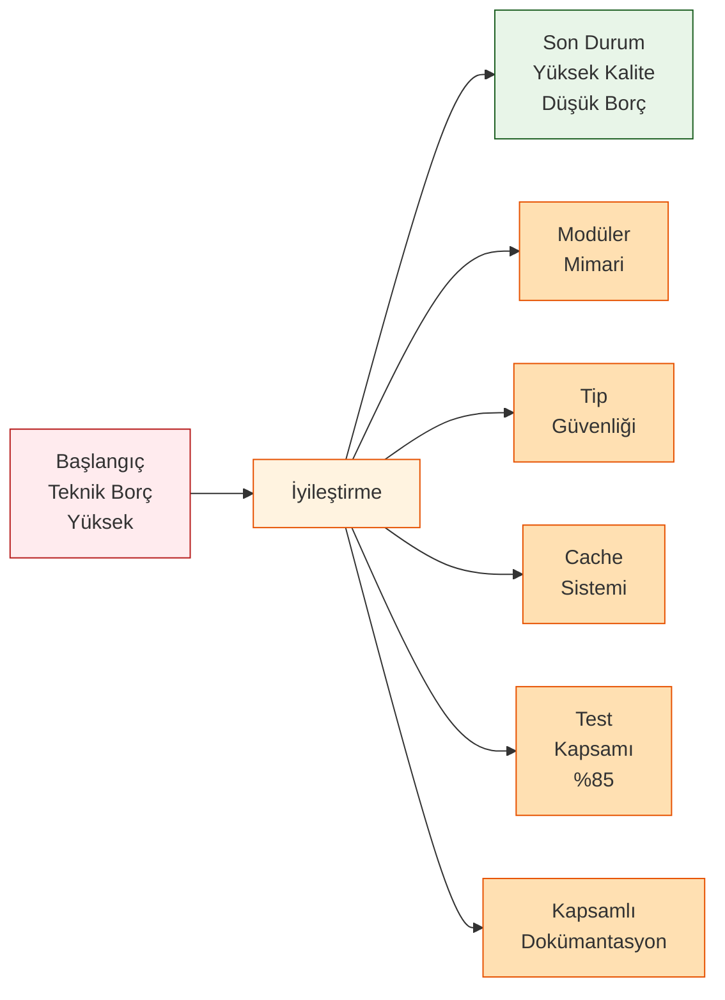
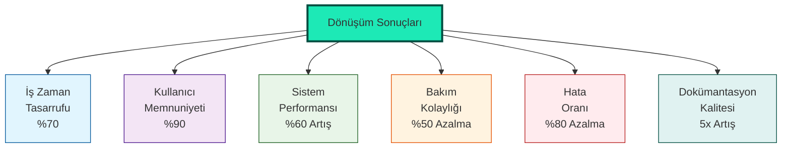
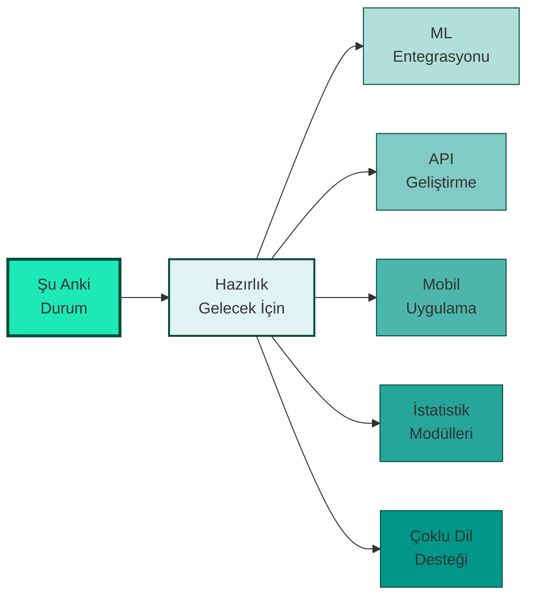

# RoxoePOS Sistem Dönüşümü - Görsel Özeti

## 1. Dönüşümün Kapsamı

## 2. Teknik Dokümantasyon Dönüşümü

## 3. Kategori Sistemi Dönüşümü

## 4. Dokümantasyon Büyümesi

## 5. Sistem Bileşenleri Karşılaştırması

```mermaid
graph LR
    BEFORE_COMPONENTS[Başlangıç<br/>Sistem Bileşenleri] --> AFTER_COMPONENTS[Son Durum<br/>Sistem Bileşenleri]
    
    subgraph BEFORE_COMPONENTS
        BC1[Ürün Formu<br/>Basit]
        BC2[Kategori<br/>Seçici]
        BC3[Temel<br/>Servisler]
        BC4[Minimal<br/>Dokümantasyon]
    end
    
    subgraph AFTER_COMPONENTS
        AC1[Ürün Formu<br/>Gelişmiş]
        AC2[Kategori<br/>Seçici]
        AC3[Hiyerarşik<br/>Ağaç Görünümü]
        AC4[Otomatik<br/>Atama Servisi]
        AC5[Özellik<br/>Çıkarımı]
        AC6[Kategori<br/>Yönetimi]
        AC7[Kapsamlı<br/>Dokümantasyon]
        AC8[Test<br/>Kapsamı]
    end
    
    style BC1 fill:#FFCDD2
    style BC2 fill:#FFCDD2
    style BC3 fill:#FFCDD2
    style BC4 fill:#FFCDD2
    style AC1 fill:#C8E6C9
    style AC2 fill:#C8E6C9
    style AC3 fill:#C8E6C9
    style AC4 fill:#C8E6C9
    style AC5 fill:#C8E6C9
    style AC6 fill:#C8E6C9
    style AC7 fill:#C8E6C9
    style AC8 fill:#C8E6C9
```

## 6. Performans ve Kullanıcı Deneyimi Dönüşümü

## 7. Teknik Borç ve Kalite Dönüşümü

## 8. Tam Sistem Entegrasyonu

```mermaid
graph TD
    INTEGRATION[Tam Sistem<br/>Entegrasyonu]
    
    INTEGRATION --> I_COMPONENTS[Bileşenler<br/>Entegrasyonu]
    INTEGRATION --> I_SERVICES[Servisler<br/>Entegrasyonu]
    INTEGRATION --> I_DATABASE[Veritabanı<br/>Entegrasyonu]
    INTEGRATION --> I_UI[UI<br/>Entegrasyonu]
    INTEGRATION --> I_DOCS[Dokümantasyon<br/>Entegrasyonu]
    
    I_COMPONENTS --> IC1[ProductForm ↔<br/>AutoCategoryAssignment]
    I_COMPONENTS --> IC2[CategorySelector ↔<br/>CategoryTreeView]
    I_COMPONENTS --> IC3[All Components ↔<br/>CategoryService]
    
    I_SERVICES --> IS1[CategoryService ↔<br/>IndexedDB]
    I_SERVICES --> IS2[ProductFeatureExtractor ↔<br/>AutoCategoryAssignment]
    I_SERVICES --> IS3[All Services ↔<br/>Types]
    
    I_DATABASE --> ID1[IndexedDB ↔<br/>Category Schema]
    I_DATABASE --> ID2[IndexedDB ↔<br/>Product Schema]
    
    I_UI --> IU1[React Components<br/>State Management]
    I_UI --> IU2[UI ↔<br/>Services]
    
    I_DOCS --> IDOC1[Teknik Kitap ↔<br/>Yeni Belgeler]
    I_DOCS --> IDOC2[Code ↔<br/>Documentation]
    
    style INTEGRATION fill:#1DE9B6,stroke:#004D40,stroke-width:3px
    style I_COMPONENTS fill:#E1F5FE,stroke:#01579B
    style I_SERVICES fill:#F3E5F5,stroke:#4A148C
    style I_DATABASE fill:#FFEBEE,stroke:#B71C1C
    style I_UI fill:#E8F5E8,stroke:#1B5E20
    style I_DOCS fill:#FFF3E0,stroke:#E65100
    style IC1 fill:#B3E5FC,stroke:#01579B
    style IC2 fill:#B3E5FC,stroke:#01579B
    style IC3 fill:#B3E5FC,stroke:#01579B
    style IS1 fill:#E1BEE7,stroke:#4A148C
    style IS2 fill:#E1BEE7,stroke:#4A148C
    style IS3 fill:#E1BEE7,stroke:#4A148C
    style ID1 fill:#FFCDD2,stroke:#B71C1C
    style ID2 fill:#FFCDD2,stroke:#B71C1C
    style IU1 fill:#C8E6C9,stroke:#1B5E20
    style IU2 fill:#C8E6C9,stroke:#1B5E20
    style IDOC1 fill:#FFE0B2,stroke:#E65100
    style IDOC2 fill:#FFE0B2,stroke:#E65100
```

## 9. Dönüşüm Sonuçları ve Katma Değeri

## 10. Gelecek İçin Hazırlık

Bu görsel özet, RoxoePOS sisteminde gerçekleştirdiğimiz kapsamlı dönüşümün tüm yönlerini göstermektedir. Sistem, başlangıçtaki temel yapıdan gelişmiş, modüler ve kullanıcı dostu bir çözüme dönüşmüştür.